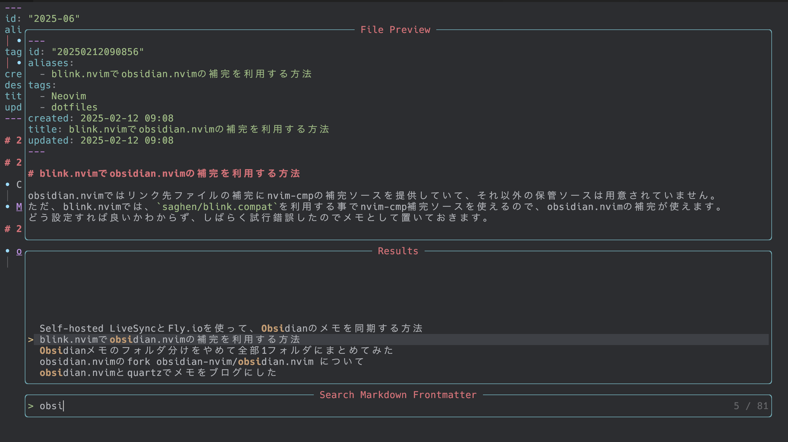

# telescope-markdown-frontmatter.nvim

A [Telescope](https://github.com/nvim-telescope/telescope.nvim) extension for searching through YAML frontmatter in Markdown files.

## Features

- Search through YAML frontmatter fields (default: `title`)
- Field-specific search support (e.g., search only titles or descriptions)
- Search multiple fields simultaneously with comma-separated syntax
- Preview file contents with automatic scrolling to the frontmatter line
- Configurable search directories and exclusions
- Support for multiple frontmatter keys
- Tab support (`<C-t>` to open in new tab)

## Demo



## Installation

### Using [lazy.nvim](https://github.com/folke/lazy.nvim)

```lua
{
  "tkancf/telescope-markdown-frontmatter.nvim",
  dependencies = {
    "nvim-telescope/telescope.nvim",
  },
  config = function()
    require("telescope").load_extension("markdown_frontmatter")
  end,
}
```

### Using [packer.nvim](https://github.com/wbthomason/packer.nvim)

```lua
use {
  "tkancf/telescope-markdown-frontmatter.nvim",
  requires = {
    "nvim-telescope/telescope.nvim",
  },
  config = function()
    require("telescope").load_extension("markdown_frontmatter")
  end,
}
```

## Usage

### Commands

```vim
" Search all configured frontmatter keys
:Telescope markdown_frontmatter

" Search a specific field
:Telescope markdown_frontmatter title
:Telescope markdown_frontmatter description
:Telescope markdown_frontmatter tags
:Telescope markdown_frontmatter author

" Search multiple fields at once
:Telescope markdown_frontmatter field=title,description
:Telescope markdown_frontmatter field=title,tags,author
```

### Lua API

```lua
-- Search all configured frontmatter keys
require("telescope").extensions.markdown_frontmatter.search()

-- Search a specific field
require("telescope").extensions.markdown_frontmatter.title()
require("telescope").extensions.markdown_frontmatter.description()

-- Or with custom field
require("telescope").extensions.markdown_frontmatter.search({ field = "author" })

-- Search multiple fields
require("telescope").extensions.markdown_frontmatter.search({ field = "title,description" })
```

### Keymaps

```lua
-- Search all configured fields
vim.keymap.set("n", "<leader>fm", function()
  require("telescope").extensions.markdown_frontmatter.search()
end, { desc = "Find Markdown by frontmatter" })

-- Search specific fields
vim.keymap.set("n", "<leader>ft", function()
  require("telescope").extensions.markdown_frontmatter.title()
end, { desc = "Find Markdown by title" })

vim.keymap.set("n", "<leader>fd", function()
  require("telescope").extensions.markdown_frontmatter.description()
end, { desc = "Find Markdown by description" })
```

## Configuration

### Setup with custom options

```lua
require("telescope").setup({
  extensions = {
    markdown_frontmatter = {
      -- Search directories (default: current directory)
      search_dirs = { "~/notes", "~/blog" },
      
      -- Directories to exclude from search
      exclude_dirs = { ".git", "node_modules", ".cache", "dist" },
      
      -- Frontmatter keys to search (can search multiple keys)
      frontmatter_keys = { "title", "description", "tags" },
      
      -- Enable file preview (default: true)
      preview = true,
      
      -- Custom prompt title
      prompt_title = "Search Markdown Frontmatter",
    }
  }
})

-- Load the extension
require("telescope").load_extension("markdown_frontmatter")
```

### Search with runtime options

```lua
require("telescope").extensions.markdown_frontmatter.search({
  search_dirs = { "~/blog" },
  frontmatter_keys = { "title", "author" },
})
```

## Default Keymaps

- `<CR>` - Open file at the frontmatter line
- `<C-t>` - Open file in a new tab at the frontmatter line

## Example Markdown File

```markdown
---
title: My Amazing Blog Post
description: A detailed guide about Neovim plugins
tags: ["neovim", "plugins", "tutorial"]
author: John Doe
date: 2024-01-15
---

# Content starts here
...
```

When searching, this file would appear in results for any of the configured frontmatter keys.

## License

MIT License - see [LICENSE](LICENSE) for details

## Contributing

Contributions are welcome! Please feel free to submit a Pull Request.

## Acknowledgments

- [telescope.nvim](https://github.com/nvim-telescope/telescope.nvim) for the amazing fuzzy finder framework
- Inspired by various Telescope extensions